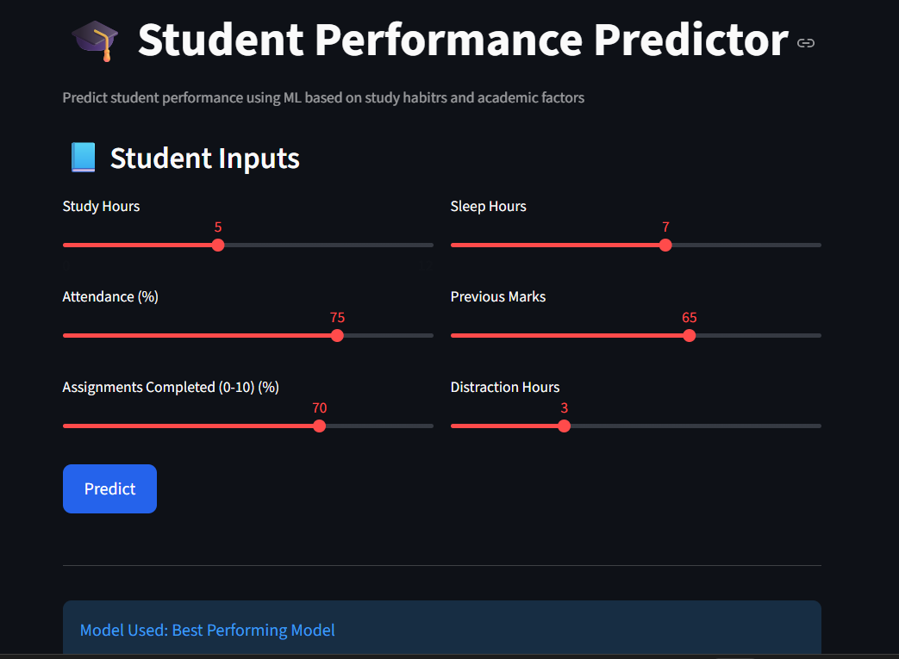
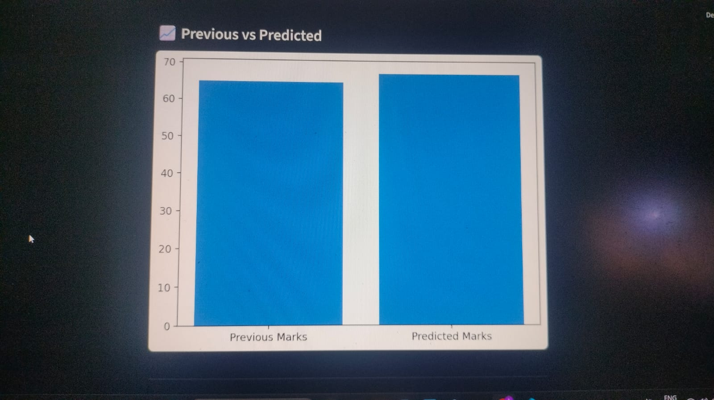
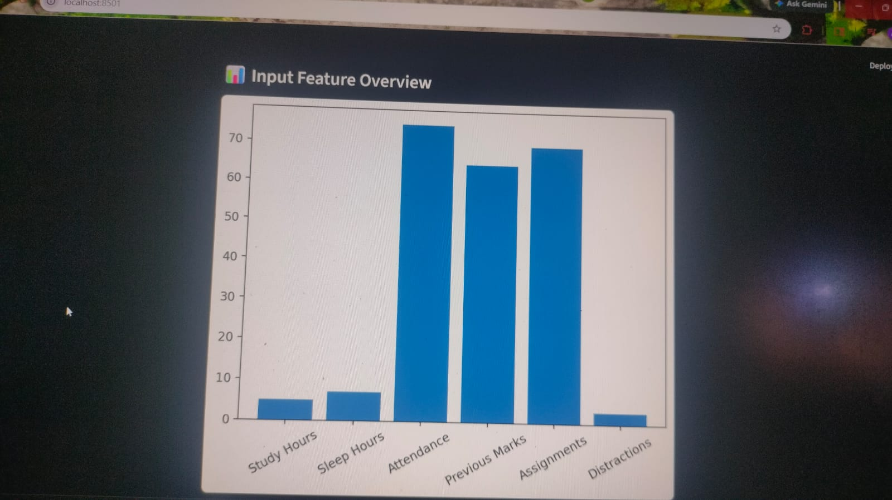

# student-performance-predictor
Machine Learning project to predict student performance using features like study hours, attendance, and previous marks. Built with Python, Scikit-learn, and Streamlit.

## Demo

